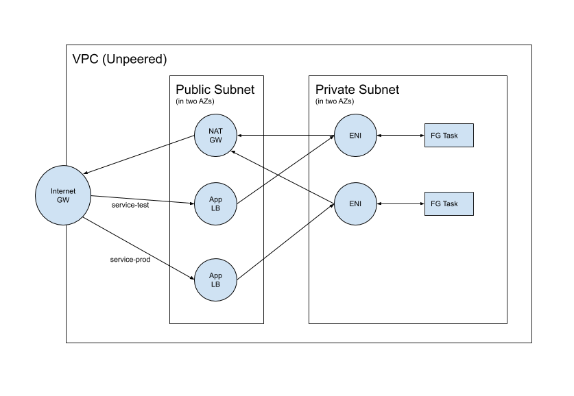
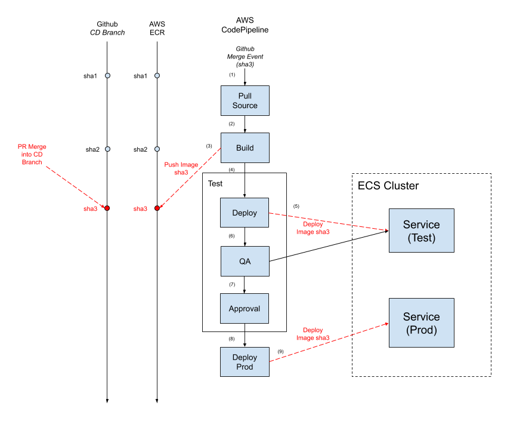

# IIIF Image Service
This will create the infrastructure to host our [IIIF Image Service](https://github.com/ndlib/image-server), which is based on [Cantaloupe](https://github.com/medusa-project/cantaloupe/). Below is a diagram of the infrastructure that will be created if you deploy this service:


The service stack uses the [iiif-service.yml](/deploy/cloudformation/iiif-service.yml) template. Below is the list of parameters that can be overridden in this template. Parameters with no default are required.

| Parameter | Description | Default |
|-----------|-------------|---------|
| NetworkStackName | The name of the parent networking stack created. | marble-network |
| InfrastructureStackName | The name of the parent infrastructure stack that you created. Necessary to locate and reference resources created by that stack. | marble-app-infrastructure |
| DomainStackName | The name of the parent domain stack that you created. Necessary to locate and reference resources created by that stack. | marble-domain |
| ImageSourceBucket | SSM path to get the name of the source bucket that the IIIF service will read from for its assets. You should override this parameter if you used a different name for your data broker stack since the path is based on it's stack name: '/all/stacks/<DataBrokerStackName>/publicbucket' | /all/stacks/marble-data-broker-test/publicbucket |
| ImageUrl | The URL of a docker image that contains the application process that will handle the traffic for this service | ndlib/image-service |
| ContainerPort | What port number the application inside the docker container is binding to | 8182 |
| ContainerCpu | How much CPU to give the container. 1024 is 1 CPU | 1024 |
| ContainerMemory | How much memory in megabytes to give the container | 2048 |
| Path | A path on the public load balancer that this service should be connected to. Use * to send all load balancer traffic to this service. | * |
| Priority | The priority for the routing rule added to the load balancer. This only applies if you have multiple services which have been assigned to different paths on the load balancer. | 1 |
| DesiredCount | How many copies of the service task to run. Scale this based on expected load. | 1 |
| CreateDNSRecord | If True, will attempt to create a Route 53 DNS record for load balancer. | True |
| HostnamePrefix | Hostname prefix to use with the service. This will be prepended to the domain created by the [domain stack](/docs/shared-infrastructure.md) to construct the host name for the service. |||

To deploy this service, you will need to create 3 stacks: a test stack, production stack, and a continuous delivery pipeline stack.

## Test
```console
aws cloudformation deploy \
  --capabilities CAPABILITY_IAM \
  --region us-east-1 \
  --stack-name marble-image-service-test \
  --template-file deploy/cloudformation/iiif-service.yml \
  --parameter-overrides HostnamePrefix=image-iiif-test
```

## Production
```console
aws cloudformation deploy \
  --capabilities CAPABILITY_IAM \
  --region us-east-1 \
  --stack-name marble-image-service-prod \
  --template-file deploy/cloudformation/iiif-service.yml \
  --parameter-overrides HostnamePrefix=image-iiif
```

## Continuous Delivery Pipeline
This will create a CodePipeline that will monitor Github for changes and deploy those changes to a test stack, then to a production stack, so it expects the two different image-service stacks above to exist.


Before you begin see https://developer.github.com/v3/auth/#via-oauth-tokens for how to generate an OAuth token for use with these pipelines.

```console
aws cloudformation deploy \
  --capabilities CAPABILITY_IAM \
  --region us-east-1 \
  --stack-name marble-image-service-deployment \
  --template-file deploy/cloudformation/iiif-service-pipeline.yml \
  --parameter-overrides OAuth=my_oauth_key
```

Below is the list of parameters that can be overridden in this template. Parameters with no default are required.

| Parameter | Description | Default |
|-----------|-------------|---------|
| SourceRepoOwner | The owner of the repository in Github to poll | ndlib |
| SourceRepoName | The name of the repository in Github to poll | image-server |
| CDBranchName | The name of the branch to watch for continuous deployment | master |
| OAuth | The OAuth Token Value to connect CodePipeline to GitHub | |
| IIIFProdServiceStackName | The name of the CloudFormation stack that created the production ECS Service | marble-image-service-prod |
| IIIFTestServiceStackName | The name of the CloudFormation stack that created the test ECS Service | marble-image-service-test |
| TestImageServerHostname | SSM path to get the hostname of the IIIF Image Server. You should override this parameter if you're overriding the IIIFTestServiceStackName parameter since the path is based on this stack name: '/all/stacks/<IIIFTestServiceStackName>/hostname' | /all/stacks/marble-image-service-test/hostname |
| ProdImageServerHostname | SSM path to get the hostname of the IIIF Image Server. You should override this parameter if you're overriding the IIIFProdServiceStackName parameter since the path is based on this stack name: '/all/stacks/<IIIFProdServiceStackName>/hostname' | /all/stacks/marble-image-service-prod/hostname |
| InfrastructureStackName | The name of the parent infrastructure stack that you created. Necessary to locate and reference resources created by that stack. | marble-app-infrastructure |
