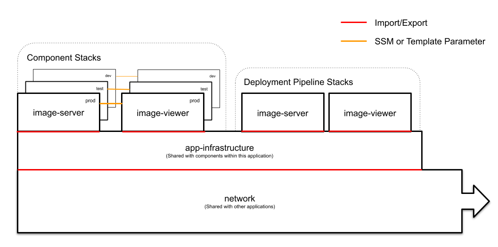

# Shared Infrastructure

Before you can deploy any of the other components, you must deploy some prerequisite pieces of shared infrastructure. These are required by both the application components and the CD pipelines that test and deploy to those application components.

For example, in the stack diagram below, all components are built on top of the network and app-infrastructure stacks. It's important to note the network and app-Infrastructure stacks are intended to be shared per environment. For example, only one of each of these will need to exist, but you can have multiple independent instances of image service and image viewer stacks for each developer.



## Network stack

The network stack will create a VPC, NAT Gateway, a set of Public and Private Subnets, and the necessary routing.

```console
aws cloudformation deploy \
  --capabilities CAPABILITY_IAM \
  --region us-east-1 \
  --template-file deploy/cloudformation/network.yml \
  --stack-name marble-network
```

Below is the list of parameters that can be overridden in this template. Parameters with no default are required.

| Parameter | Description | Default |
|-----------|-------------|---------|
| DesiredVPCCIDRBlock | The CIDR Block for the entirety of the VPC | 10.0.0.0/16 |
| PrivateSubnet1CIDR | The CIDR Block for the 1st Private Subnet | 10.0.0.0/24 |
| PrivateSubnet2CIDR | The CIDR Block for the 2nd Private Subnet | 10.0.1.0/24 |
| PublicSubnet1CIDR | The CIDR Block for the 1st public subnet - needed for NAT Gateway | 10.0.2.0/24 |
| PublicSubnet2CIDR | The CIDR Block for the 2nd public subnet - needed for NAT Gateway | 10.0.3.0/24 |

If you already have a VPC with existing subnets, you will want to use the export-existing-network template. This template is useful for mapping your existing resources to the exports that the higher level stacks will expect from the network stack:

```console
aws cloudformation deploy \
  --capabilities CAPABILITY_IAM \
  --region us-east-1 \
  --template-file deploy/cloudformation/export-existing-network.yml \
  --stack-name marble-network \
  --parameter-overrides VPC='my-vpc' \
      PrivateSubnet1='subnet-1' PrivateSubnet2='subnet-2' \
      PublicSubnet1='subnet-a' PublicSubnet2='subnet-b'
```

Below is the list of parameters that can be overridden in this template. Parameters with no default are required.

| Parameter | Description | Default |
|-----------|-------------|---------|
| VPC | The VPC ID where the required networking exists | |
| PrivateSubnet1 | One of the private subnets in your existing account | |
| PrivateSubnet2 | A second of the private subnets in your existing account | |
| PublicSubnet1 | One of the public subnets in your existing account | |
| PublicSubnet2 | A second of the public subnets in your existing account |||

## Application Infrastructure stack
Most components will reuse shared resources for things like log buckets, log groups, ECS cluster, etc. This template will create these shared resources for you.

```console
aws cloudformation deploy \
  --capabilities CAPABILITY_IAM \
  --region us-east-1 \
  --template-file deploy/cloudformation/app-infrastructure.yml \
  --stack-name marble-app-infrastructure
```

Below is the list of parameters that can be overridden in this template. Parameters with no default are required.

| Parameter | Description | Default |
|-----------|-------------|---------|
| NetworkStackName | The name of the parent networking stack | marble-network |

## Domain stack
Defines a domain and creates a wildcard certificate that can be used for services built in this domain. By default, it will create a zone in Route53 for you, but this can be skipped if you're using your own DNS by overriding the CreateDNSZone parameter.

A few things to note:
1. You will likely need to do this in us-east-1 so that your ACM certificate can be used by Cloudfront (see https://aws.amazon.com/premiumsupport/knowledge-center/custom-ssl-certificate-cloudfront/).
1. This will require adding a DNS entry to validate the certificate created by the stack. The stack will not complete until this is done. See https://docs.aws.amazon.com/acm/latest/userguide/gs-acm-validate-dns.html. If you are creating a Route53 zone in this stack, you can add a record to the new zone as soon as both the zone and cert are created by the stack.

```console
aws cloudformation deploy \
  --capabilities CAPABILITY_IAM \
  --region us-east-1 \
  --template-file deploy/cloudformation/domain.yml \
  --stack-name marble-domain
```

Below is the list of parameters that can be overridden in this template. Parameters with no default are required.

| Parameter | Description | Default |
|-----------|-------------|---------|
| DomainName | The domain or sub domain to be used for all entities created | library.nd.edu |
| CreateDNSZone | If True, will attempt to create a Route 53 zone for this domain. | True |
| UseDNSZone | Optional parameter to use a DNS zone if one already exists for this domain |||

If using your own external DNS, specify CreateDNSZone=False and UseDNSZone=''. The template will then only create the ACM certificate using the provided domain name. You will then need to validate your certificate by entering a DNS entry manually, see [Use DNS to Validate Domain Ownership](https://docs.aws.amazon.com/acm/latest/userguide/gs-acm-validate-dns.html)

## Data Broker stack
This was intended to eventually be a data layer used by most components, but is currently only used by the image service and manifest pipeline as the S3 data store for images. Depending on how the architecture matures, this may be removed.

```console
aws cloudformation deploy \
  --region us-east-1 \
  --stack-name marble-data-broker-dev \
  --template-file deploy/cloudformation/data-broker.yml
```
